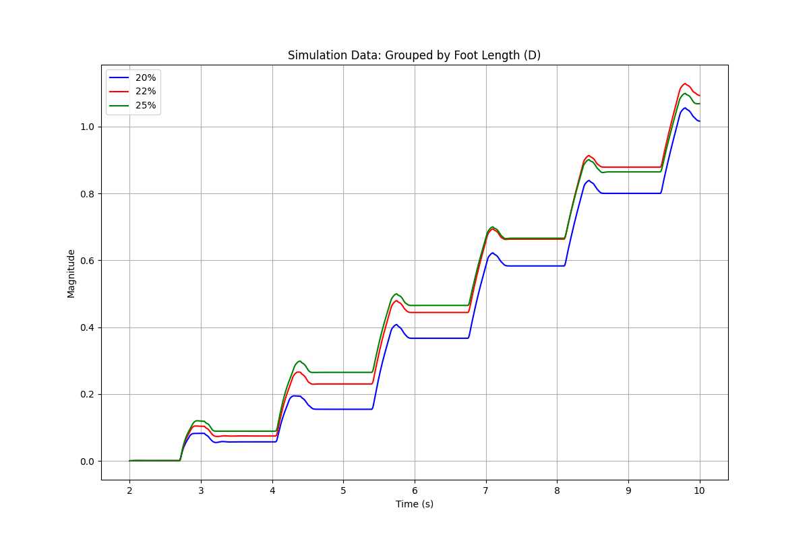

# Project Assignment 2: Design, Build, and Simulate Your Robot

*By Jacob Pisors and Michael Gross*

## Project Overview

Continuing with the project's previous research, the team hopes to define the frog five-bar model in simulation using Mujoco, building off the kinematics. Then optimize the parameters for design, namely the joint stiffness, overall length, and various link lengths. Given this, the team will plan and fabricate the prototype using foldable robotics methods, and use then test it and capture the results. With that, an experimental validation will be complete and the team can analyze the results.

Specifically, the scope of this project is given the frog's inherent body mass, how can we reconfigure the link lengths and material stiffness of the five-bar mechanism, representative of rear frog legs, to determine the optimal vertical and horizontal propulsion during its jumping gait. The rationale for this decision is explained in part 2, where we optimized the design.

___

### Part 1: Define the System Model

The model, as linked [here](frogModel.xml), allows for link lengths and joint stiffness to be changed easily by passing in the desired lengths. This will update the model and help when re-running the simulation many times as needed for optimization.

The team used [motor characterization](Frog_Model_Optimization.ipynb) and [compliant beam analysis](links.ipynb) to determine the model parameters. 

Additionally in this step, considering the desire for a two-foot jumping gait, the team determined through the motor motor characterization and analysis that there was a physical constraint to the design of the controller and the max potential impulse. The minimum time in which we could use the full 180-degree motion of the servo was about 0.35 seconds which not only determined how fast the legs could move but how fast they could retract before landing.

___

### Part 2: Optimize your Design

#### Optimization of Link Lengths

The team noticed that the link length D, or the “foot” of the robot, had the largest variation of length in the optimization step, causing our team to investigate whether this meant the greatest impact on distance. Or rather, it was the most important factor of the five-bar when determining the jumping behavior of the frog. Thus, we decided to vary this parameter and analyze its effect.

For future manufacturing steps, the team also looked into the optimal stiffness and how the distance was affected. That can be seen in the figure below.

To test this model, we developed a very modular, yet simple frog XML [simulation file](frogModel.xml). This allowed the team to change any parameter from frog leg lengths to segment mass. The design we went for was representative of the final physical structure, requiring a flat mounting point for electronics and compliant, skid-style front legs. The XML was dynamically regenerated using an XML template.

The metric that best describes the performance of the frog robot is the total distance traveled or the magnitude of the x and y distance. We wanted to prioritize this as it best represents the physical bio-inspired counterpart. Additionally, it prevents the simulation optimizer from biasing towards a sliding robot or a high-vertical jumping robot rather than a healthy balance between the two.

Despite adding the capability within our XML, the team opted to use the prismatic joint position and time derivative thereof: `qpos()` & `qvel()`. We made custom methods to make the process and access to such simulation variables easier.

The team used the `scipy.minimize.optimize()` function in Python which is a non-linear approach utilizing gradient descent. As shown above, in the scatter plot of each foot segment, we can see a convergence of ideal foot length segments given inter-variate relationships, and frog mass, among other variable influences. In addition to each leg segment per the jump distance, we also investigated the relationship between the front two leg segments, B+C, and the hind leg segments, D+E.

Considering our earlier observance of how the variance of D had the largest impact on jump distance and how we originally suspected that to be the “foot” segment, we chose to vary that segment based on a percentage makeup of the full leg length.

To make a similar experiment, the team plans to make a program to change the link length of D whilst keeping the proportions mostly the same and the overall length the same. Swapping out legs and attaching a servo to segment B on each and making a frog body to keep it stable. More on this in the next sections.

___

### Part 3: Plan and Execute the Manufacturing

The mechanism that will be fabricated will be the five-bar mechanism that represents the frog's legs. This was done in LibreCAD, as seen in the figure below. Where the red line indicates the body and the blue lines indicate joints. The extra link at the end is a tab used for connecting the five bars.

The link lengths were influenced by the simulation. From the sim, the team knew we wanted to test out how link D, the "foot" affected the jump distance. However, from our simulation, we also gathered ideal proportions of the links for jumping. So, using those proportions, we found out how to dynamically adjust the percentage that links D relative to the overall length whilst keeping the proportions as similar as possible. So we could adjust the percentage we wanted link D to be in our code and have it output where the joints should be in our model. Here is the Python code for this explanation *link*. Below is a figure comparing the percentages of link D we chose to study, based on our simulation that showed that as link D was a greater percentage (up to a certain point), jump performance should be improved.

This was manufactured using a five-layer approach, with the layers being rigid, adhesive, hinge, adhesive, and rigid respectively. Where the rigid layers represent the links, and are similar to the adhesive layer. The hinge layer is for the joints. These layers were derived from the original LibreCAD model and then adjusted with shapely and foldable_robotics libraries to produce dxf files that we could cut and laminate to make the final mechanism. See the jupyter notebook file for more details. The dxf files used are in the cut files folder on the GitHub page. See the figures below for a sample of what the cut files looked like and the final device.

With all the variants of the leg mechanism made, it was time for testing. First, the mechanism was folded into the five-bar. Then, since the frog needed to jump, we created a lightweight body frame out of cardboard. The servos were attached underneath and connected to the "B" bar from the side. The servos were connected to the body using a binder clip. We could also easily adjust the weight using binder clips. For the front leg of the robot, we used a passive leg with tuned stiffness from real testing to allow it to take some of the impacts of a jump and collapse like a real frog's front legs, with a slider on the bottom to reduce friction and rubber band to adjust stiffness. Rubber from cut strips of rubber bands were glued to the foot link to add friction between the previously smooth surface. Lastly, we realized we had not properly considered the weight of the mechanism about the torque of the servos, so to account for this we removed approximately 30 grams of weight using helium balloons. 

For the electronics and code, the servos were wired up using long wires to allow for testing multiple jumps, and the ESP32 code was set to the same gait cycle as the simulation. Upon rebooting, the code would execute for 10 seconds, which equated to eight jumps. The hip motor control was timed to allow the gait to jump and then retract the legs while it was moving forward and "jumping." See the code [here](FrogJump-ESP32_Controller/main.py). The wires and ESP32 were held during testing to ensure they did not interfere with the frog. The IMU was not used due to the error from attempting to take the position from it being too large and accumulating too fast.

#### Recorded Behavior

During testing, it seemed that the 20% D leg length was the most consistent in distance and jump height. The 22% was relatively flat, and the 25% was inconsistent but looked to produce some of the highest jumps, but this did not correspond with the furthest distance. The furthest distances traveled were about three feet, and the highest jumps were only a few millimeters off the ground. See the figure below for the results which show (what they show). These results were from using motion tracking on the frog, where the marker was tracked by frames per second. 

*Real experimental data of each group. Three runs were done of each.*

The figure confirms a lot of the qualitative data. Where the 20% D segment outperformed. The 25%, with some relatively high spikes in magnitude, ultimately did not go as far as the others. The results were that the frog can hardly jump, though it can move forward through this gait. This is somewhat expected, though disappointing when considering the max speed and torque the servo motors could provide. A jump requires more of an impulse, way higher than that of walking motion - something the five-bar mechanism could not provide in its configuration.

It should be noted that during testing various problems could have accounted for this data. More on this in the Experimental Validation and Analysis section.
___

## Experimental Validation and Analysis

The figures below compare our simulated data group to the real-world results. Where we kept constant mass and dimensions in our simulation to real life to the best of our ability. The length of segment D was changed, as explained in optimization.

The data did not prove the hypothesis and simulation that the larger percentage of the foot segment would lead to a greater jumping distance. Rather, a refined balance based on the controller timing and foot trajectory is necessary to produce a greater jump. Also, the angle of the foot was not taken into account, which is a contributing factor.

Whilst the team attempted to use an IMU for data collection, the position, double derived from the acceleration, accumulated too much error too quickly and was not useful. Pivoting to using motion tracking software, Tracker, and a marker on the robot to collect the x and y positions about time. The data from this was exported via a .csv file and cleaned and compared to the simulation data. The small scale of the robot and changes could also have been a contributing factor to the results not being as clear as the simulation. Where changes in the small and delicate system can have unintended consequences. For example, some of the leading sources of error between the sim-to-real gap were friction and motor characteristics. Initially, the motors in the simulation were more powerful than they should have been. While we ended up changing them after characterization to be more accurate, they still underperformed in testing. Friction forces such as drag and the poor friction between the foot and surface also affected performance. Changing the surface could have improved this.

Furthermore, in the next version of this device, I would like to upgrade the servos and work more with the five-bar mechanism to add stiffness and have multiple servos on each leg so that the control can be better optimized for jumping and the stiffness can build and act as a spring.

___
